<div align="center">
  
</div>

<p align="center">
  <a href="https://github.com/elias001011">
    
  </a>
</p>

<p align="center">
  
  
  
  
</p>

---

## 👋 Quem sou eu

Sou o **Elias Nunes**, um dev que gosta de transformar ideia em produto: interface bonita, fluxo real de usuário, IA quando faz sentido, backend serverless quando precisa proteger chave/API e bastante tentativa até ficar bom.

Meu trabalho hoje gira muito em torno de **apps web com React**, **experiências com IA**, **dashboards climáticos**, **ferramentas educacionais** e projetos que tentam sair do “só funciona” para parecerem produto de verdade.

```txt
produto > template
clareza > firula
aprender fazendo > esperar estar pronto
```

---

## 🚀 Projetos que melhor representam meu trabalho

<table>
  <tr>
    <td width="50%">
      <h3>☄️ <a href="https://github.com/elias001011/Meteor">Meteor</a></h3>
      <p>PWA de inteligência climática com previsão, alertas, mapas, temas dinâmicos e assistente com IA generativa contextual.</p>
      <p>
        
        
        
        
      </p>
      <p><strong>Destaques:</strong> BFF com Netlify Functions, Gemini, fallback de APIs meteorológicas, AQI, mapas e privacidade local-first.</p>
    </td>
    <td width="50%">
      <h3>🎓 <a href="https://github.com/elias001011/Apice">Apice</a></h3>
      <p>Plataforma educacional com corretor de redação, Professor IA, simulados, radar, conquistas, autenticação e histórico.</p>
      <p>
        
        
        
        
      </p>
      <p><strong>Destaques:</strong> múltiplos provedores de IA, cotas, modo convidado, correção com backend, temas dinâmicos e UX de produto.</p>
    </td>
  </tr>
  <tr>
    <td width="50%">
      <h3>🌧️ <a href="https://github.com/elias001011/Meteor-LandingPage">Meteor Landing Page</a></h3>
      <p>Landing page cinematográfica do Meteor, com storytelling, animações de scroll, galeria e dados climáticos reais do RS.</p>
      <p>
        
        
        
        
      </p>
      <p><strong>Destaques:</strong> scroll pinning, cursor customizado, chuva em canvas, lightbox e narrativa sobre alertas climáticos.</p>
    </td>
    <td width="50%">
      <h3>🌙 <a href="https://github.com/elias001011/SonarCloud">SonarCloud</a></h3>
      <p>Soundscape player minimalista para foco, relaxamento e sono usando faixas do SoundCloud.</p>
      <p>
        
        
        
        
      </p>
      <p><strong>Destaques:</strong> timer com fade out, temas, layout flexível, player persistente e suporte mobile.</p>
    </td>
  </tr>
  <tr>
    <td width="50%">
      <h3>🌦️ <a href="https://github.com/elias001011/Climova">Climova</a></h3>
      <p>Dashboard de clima com glassmorphism, recomendações tipo “Mini IA”, fundos dinâmicos e funções serverless.</p>
      <p>
        
        
        
        
      </p>
      <p><strong>Destaques:</strong> geocodificação, previsão de 5 dias, imagens por cidade/clima e proteção de API keys no backend.</p>
    </td>
    <td width="50%">
      <h3>🖥️ <a href="https://github.com/elias001011/elias001011.github.io">Portfolio</a></h3>
      <p>Meu site pessoal em React + TypeScript, feito para organizar projetos, presença dev e experimentos visuais.</p>
      <p>
        
        
        
      </p>
      <p><strong>Destaques:</strong> deploy com GitHub Pages, Vite, React 19 e uma base pronta para mostrar projetos com mais força.</p>
    </td>
  </tr>
</table>

---

## 🧠 O que eu venho construindo na prática

- **Apps com IA de verdade:** endpoints serverless, fallback entre provedores, validação de entrada, cotas e tratamento de erro.
- **Produtos web completos:** autenticação, rotas protegidas, histórico local, planos, onboarding e páginas de landing.
- **Experiências visuais:** glassmorphism, animações, scroll storytelling, temas dinâmicos e interfaces responsivas.
- **Clima e dados em tempo real:** OpenWeather, Open-Meteo, mapas, AQI, alertas e contexto local.
- **Aprendizado em público:** commits, refactors, bugs, deploys e melhorias constantes.

---

## 🛠️ Stack e ferramentas

<p align="center">
  
</p>

<p align="center">
  
  
  
  
  
</p>

---

## 📊 GitHub em números

<p align="center">
  
  
</p>

<p align="center">
  
</p>

<p align="center">
  
</p>

---

## 🧩 Meu jeito de desenvolver

```ts
const elias = {
  foco: ['produto', 'IA aplicada', 'UX', 'serverless', 'deploy'],
  gostaDe: ['interfaces bonitas', 'ferramentas úteis', 'projetos com propósito'],
  aprendendo: ['arquitetura melhor', 'backend mais sólido', 'open source bem apresentado'],
  filosofia: 'lançar, observar, melhorar e repetir',
}
```

---

## 🌐 Links

<p align="center">
  <a href="https://github.com/elias001011">
    
  </a>
  <a href="https://elias001011.github.io">
    
  </a>
  <a href="https://meteor-ai.netlify.app">
    
  </a>
</p>

---

<div align="center">
  
</div>
